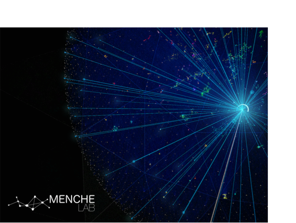

# Course in Network Science - online material

This repo contains jupyter notebooks and datasets to support 
the course 
### 'Introduction to complex network analysis' 
by Prof. Jörg Menche assisted by Dr. Felix Müller from the University of Vienna. 

The content is based on the online material from
https://github.com/CambridgeUniversityPress/FirstCourseNetworkScience/

## Howto run Jupyter Notebooks

Our tutorials use Python 3 and NetworkX (2.4 or later).  

You can run Python locally on your laptop by installing Jupyter/IPython on your machine, we recommend installing the [Anaconda](https://www.anaconda.com/distribution/) Python distribution with Python 3. This option requires that you are comfortable with managing software packages (i.e., using `pip` or `conda`). 

Make a folder on your machine and clone this repo into it by changing into your folder running the following command in your terminal

> git clone git@github.com:menchelab/network_course.git

In order to work with the notebooks and have your modification personalized you need to make your own branch:

> git branch --branchname--

The name of your branch should be a identifiable shortcut of your name. You can switch to your branch with

> git checkout  --branchname--

Now you can upload your modified notebook to your branch with

> git add --yourfile--
> git commit -m "yourmessage"
> git push origin --branchname--

There will be changes in the main branch by us on a regular basis. Make sure that you have the latest version of the current notebooks by downloading them to your local machine:

> git pull origin main
> git push origin --branchname--

These two commands should be run as soon as you have aranged your git branch in order to get all files into your peronalized branch.
  
To make sure that your personal notebooks doesn't get replaced rename them after you have received the files from the main branch (e.g. Tutorial1.ipynb into Tutorial1_JohnnyDepp.ipynb) 

## Additional Datasets 

* [Dataset files](https://github.com/menchelab/network_course/tree/main/datasets)
